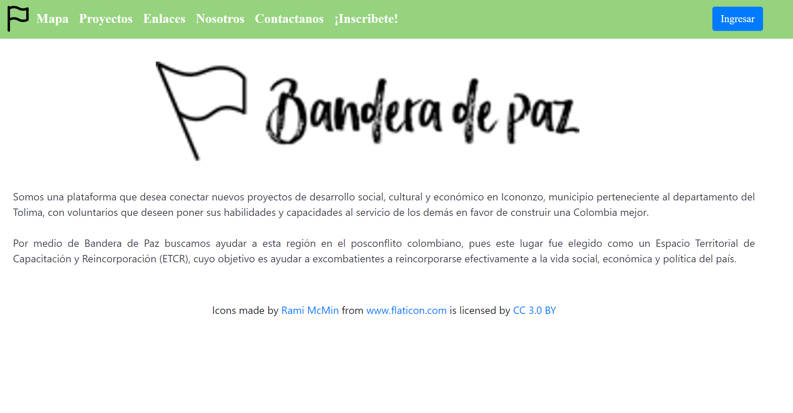

# IcoVoluntarios's Web Page
  
This project was created with Meteor, React, dhtmlxScheduler and MongoDB.

## Table of Contents

- [Objetives](#Objectives)
- [How do you run?](#Howdoyourun?)
- [Authors](#Authors)
- [Others](#Others)
  - [Screenshot](#Screenshot)
  - [MIT License](#MITLicense)

### Objectives

- It is a platform to connect projects in the municipality of Icononzo, Colombia with different volunteers interested in being part of them 

- With my partner we wanted to learn to integrate technologies like Meteor and dhtmlxScheduler in an application that was useful for different types of people interested in being part of a volunteer.

### How do you run?

- If you try to run the project locally, you need to download the repository content. Remember it is necessary to have locally installed Meteor. After verifying the above, you must open the operating system console and through this you must navigate to reach the folder where the file mentioned above was downloaded. There you must execute the command "meteor", this in the case of windows. Finally, you must add the address "http: // localhost: 3000" in the browser and you can see the application displayed.

- But you can trie visit the web page with the following URL: http://icovoluntarios.herokuapp.com/.

### Authors
Andrés Felipe Moreno Marin
https://afmoreno10.github.io/

María Camila Hernández 
https://mchernandez1.github.io/

### Others

  #### Screenshot
  

  #### MIT License
  This project is licensed under the MIT License - see the LICENSE.md file for details
